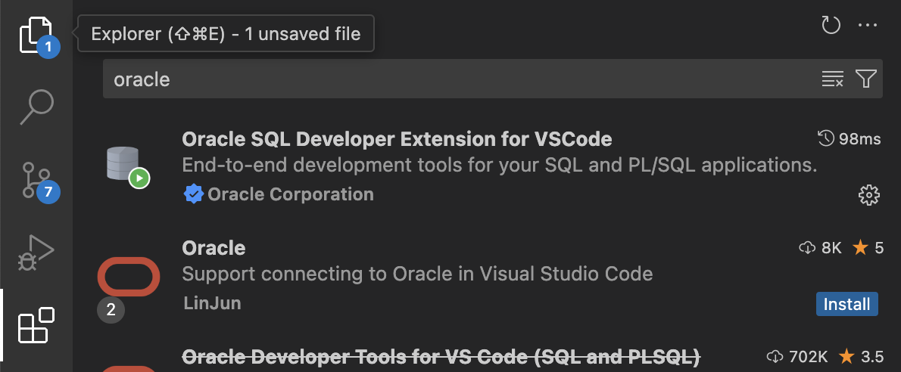

### Installing Docker and Oracle Image

1. Please ensure your computer is efficient enough to run docker desktop

2. [Download](https://docs.docker.com/desktop/setup/install/windows-install/) docker desktop

3. Use the following programs to run commands in upcoming instructions

- `cmd`(Windows)
- `terminal`(MacOs/ Linux)

4. After docker desktop installed, pull this images below:

- [oracle-free](https://hub.docker.com/r/gvenzl/oracle-free) `docker pull gvenzl/oracle-free`

### Oracle Free

1. Launch container `oracle-free`. Note the following
   `docker run -d --name my-oracle2 -p 4000:4000 -p 1521:1521 -e ORACLE_PASSWORD=Test123 -e APP_USER=student1 -e APP_USER_PASSWORD=Hello123 -v /Users/MY-SELF/Documents/data-oracle:/opt/oracle/`

- `--name my-oracle2` is your container name, feel free to customise further
- mapping "your-machine-properties":"container-properties"
- `-p 1521:1521` port 1521 is oracle default
- `-p 4000:4000` port 4000 for debugger
- `-e ORACLE_PASSWORD=Test123` environment variable: oracle password (for sys users)
- `-e APP_USER=student1` environment variable: app user
- `-e APP_USER_PASSWORD=Hello123` environment variable: app user password
- `-v /User/MY-SELF/Documents/data-oracle:/opt/oracle/`
  - Volumne mapping `/User/MY-SELF/Documents/data-oracle` is your machine's local drive.
  - For windows, should be `C:\window_users\your_name\Documents\your_folder` or any other drive you prefer. Your data will be stored here.
  - `/opt/oracle/` is the drive within container that docker will map. This is pre-determined by the image author. Just leave this as is.
  - When container is running, it will try to save into `/opt/oracle/` but this drive is directly associated with your local drive, so the data will be saved externally.
  - Whenever you restart container (after you stopped), data will remain intact as container mounts your local folder onto its `opt/oracle`.
  - Should you choose NOT to map volumne, your container data will not persist between docker container restarts.

2. With your container running, attempt to login to oracle server.

```
sqlplus <USER-NAME>/<USER-PASSWORD>@<HOST-NAME>:<HOST-PORT>/<DATABASE or SERVICE>
sqlplus student1/Hello123@localhost:1521/FREEPDB1
```

### Oracle SQL Developer Extension

1. Install Oracle SQL Developer Extension



_Figure: Install the first extension that appears_

2. You're ready to follow instruction as per youtube video below for vscode Oracle SQL Developer Extension:

- [Introduction](https://www.youtube.com/watch?v=IzbAWawWPNQ)
- [Debugger](https://www.youtube.com/watch?v=AyE44WXwTaE)
