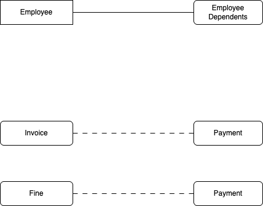
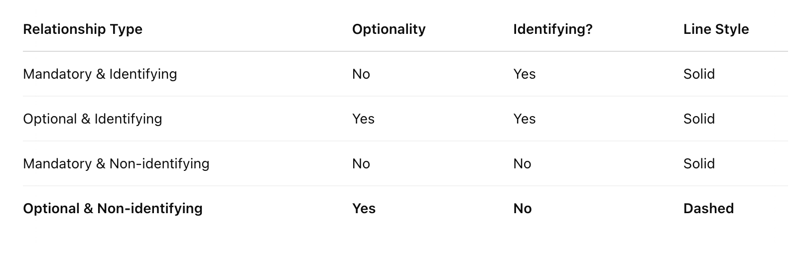

## SECTION1: Crowsfeet

Offers 2 kinds of relationships indicated by

- solid line
- dashed line

**SOLID LINE** means identifying relationship

**DASHED LINE** means non-identifying relationship

## Identifying Relationship

Here's an example of identifying relationship, between "Employee" and "Employee Dependent"

```
    "Employee"
    - employee_id (primary key)
    - employee_name
    - position (enum: CLERK, MANAGER, CEO)
    - date_created

    "Employee Dependent"
    - employee_id (primary key, composite)
    - dependent_name (primary key, composite)
    - dependent_age
    - dependent_relation (enum: SPOUSE, FATHER, MOTHER, CHILD)
```

Example records:

```
    - "Employee Dependent" records:
        - E1, SAM, 82, FATHER
        - E1, MARY, 40, SPOUSE
        - E1, BEN, 12, CHILD
        - E1, KAREN, 12, CHILD (alert! same name)

        - E2, AHMAD, 72, FATHER
        - E2, FATIMAH, 45, SPOUSE
        - E2, KAMAL, 14, CHILD
        - E2, KAREN, 13, CHILD (alert! same name)
```

- We can clearly see 2 dependents share the same name KAREN.
- Because they share same name, its impossible to differentiate these "KAREN"s.
- We need another key to uniquely identify KAREN, via employee_id. So KAREN of E1, is differentiated from KAREN of E2.
- Thus, "Employee Dependent"s primary key is a composite of _**employee.employee_id**_ and _**dependent_name**_.

---

- The relationship between "Employee" and "Employee Dependent" is **IDENTIFYING RELATIONSHIP** because "Employee Dependent" composite pk includes "Employee" pk (via _**employee.employee_id**_)
- "Employee Dependent" is strongly connected to "Employee"
- also known as **STRONG** relationship, because of this STRONG dependency + TIGHTLY coupled relationship
- Thus, **SOLID LINE** in Crowsfeet

---

## Non-Identifying Relationship

This is where relationship between 2 entities are not connected via composite pk. Sample below:

```
    "Invoice"
    - invoice_id (primary key)
    - source_company_id (from: company A, Im the owner of this invoice, Im requisiting payment)
    - target_company_id (to: company B, please pay up)
    - invoice_no
    - invoice_date
    - invoice_amount
    - issuer_name
    - payment_id (foreign key)

    "Fine"
    - saman_id (primary key)
    - offence_id
    - saman_date
    - saman_amount
    - saman_due_date
    - is_reminder1_sent
    - is_reminder2_sent
    - is_reminder3_sent
    - payment_id (foreign key)

    "Payment"
    - payment_id (primary key)
    - payment_date
    - payment_bank
    - payment_amount
```

- Invoice <--> Payment is **NON-IDENTIFYING**. "Invoice" doesnt participate in identifying "Payment".
- Fine <--> Payment is **NON-IDENTIFYING**. "Fine" doesnt participate in identifying "Payment".

---

- In fact Invoice records, Fine records can exist without Payment.
- They can exists INDEPENDENT of Payment.
- They are not COUPLED together.

---

- Payment can also exist without Invoice records (not making any business sense, but conceptually observing our design, this is true)
- Payment can exists INDEPENDENT of Invoice, Fine
- They are not COUPLED together.
- Reason:

  1. There's no composite primary key to begin with
  2. payment.payment_id not involved in pk of invoice table (its just a foreign key, not in composite primary key)
  3. payment.payment_id not involved in pk of saman table (its just a foreign key not in composite primary key)
  4. invoice.invoice_id not involved in pk of payment table
  5. fine.saman_id not involved in pk of payment table

---

- "Invoice" is weakly connected to "Payment"
- "Fine" is weakly connected to "Payment"
- also known as **WEAK** relationship
- Thus, **DASHED LINE** in Crowsfeet

## Example Diagram



## SECTION2: QUESTION

### Question1

But my invoice payment relationship is STRONG!

Yes, it could be designed as such. Example below:

```
    "Invoice"
    - invoice_id (primary key)
    - source_company_id (from: company A, Im the owner of this invoice, Im requisiting payment)
    - target_company_id (to: company B, please pay up)
    - invoice_no
    - invoice_date
    - invoice_amount
    - issuer_name
    - payment_id (foreign key)

    "Payment"
    - invoice_id (composite primary key, referring to invoice.invoice_id)
    - payment_timestamp (composite primary key, NOTE: date + time)
    - payment_bank
    - payment_amount
```

- Invoice <--> Payment is **IDENTIFYING RELATIONSHIP**. Note _**invoice.invoice_id**_ is one of "Payment"'s composite pk.

  Assumption:

  - One invoice, many payments design
  - 1 invoice takes payment A, payment B, payment C to be completely paid for

### Question2

Means in my Crowfeet diagram, most relationship will be **weak relationship**?

Yes by reasoning in (1) most of your relationship should be weak. Failing to do so will result in 1 mark deduction off Crowfeet diagram

### Question3

But my diagraming tool denote dash lines for another kind of relationship!

Yup, quite possible that said relationship is "optional relationship". Example below:

```
    "Book Loans"
    - book_id (not-null, primary key)
    - member_name (not-null, primary key)
    - date_checkout (not-null, primary key)
    - date_expired (not-null, [explain: this is date book loan expired])
    - date_returned (nullable, [explain: this is date book actually returned])
    - fine_id (nullable, [explain: only books returned AFTER date_expired should be FINED. So is optional relationship])
```

- for above relationship, its typically related with a circle on crowfeet. On top of that, there are tools that denote with dashed line as well.

To confuse matters further, chatgpt suggest below... (mind blown yet?)


### Question4

Ok, so there's clearly a conflict. What's to be done now?

STAY CALM. Lets go with the well-known standard, as per [SECTION1: Crowsfeet](#section1-crowsfeet)

- If a relationship is **non-identifying**, dashed lines.
- If the relationship is **identifying**, solid lines (remember the composite pk with one of pk referencing parent table?)
- Your diagram should end up with a lot of dash lines because I can see most of your diagrams DO NOT apply identifying relationship

### Question5

Im confused, Weak/ Strong Entities or Weak/ Strong Relationships?

Actually entities vs the relationships between them are separate matters.

We've already explained relationships between entities earlier. Now lets look at entities and how to categorise them.

#### Entities

Strong entities can exists without mandatory reference to other tables.
Example:

```
    book
    - copy_id
    - title_id (NOT NULL)
    - category_id (NOT NULL)
    - author (assuming only 1 author for each book)
    ...

    category
    - category_id
    - category name
    ...

    title
    - title_id
    - title_name
    - publisher
    ...
```

- book can exists independently without other tables kah? macam yes from diagram.
- But practically, book MUST come with a title and a category.

---

- Both fields (_**book_copy.title_id**_, _**book_copy.category_id**_) can NEVER be nulled.
- Each book record should have reference to title and category.
- Because of these mandatory reference (NOT NULL), its a **WEAK** entity
- Because its DEPENDENT, its a **WEAK** entity

---

- **IF** both fields (_**book_copy.title_id**_, _**book_copy.category_id**_) are NULLABLE, book can turn into strong entity
- Because of these optional reference (NULLABLE), its a **STRONG** entity
- Because its NOT DEPENDENT, its a **STRONG** entity

---

- Category entity, on the other hand, needs no other table references
- category is a strong entity because it can exist without referencing other entities
- typically relationship between strong entities are denoted with dash lines, because it is not identifying relationship
- strong entity with weak entity, check if they are strongly coupled together. Read [Identifying Relationship](#identifying-relationship)
- strong entity with weak entity, if not tightly coupled together, then its still dashed lines

References:

- Weak/ Strong Relationship - https://www.youtube.com/watch?v=lkWB-R0DM6M&t=7m30s
- Weak/ Strong Entities - https://www.youtube.com/watch?v=9gxxu5E2-SQ&t=2m40s
- Find "Relationships are the glue..." and read - https://opentextbc.ca/dbdesign01/chapter/chapter-8-entity-relationship-model/
- Find "Slide 9" and read relationship strength - https://www.cs.dartmouth.edu/~cs61/Lectures/04%20-%20ER%20Modeling/04%20-%20ER%20Modeling.html
- Optional relationship - https://eng.libretexts.org/Courses/Delta_College/Introduction_to_Database_Systems/04%3A_Integrity_Rules_Constraints_and_Functional_Dependencies/4.03%3A_Relationship_Types
